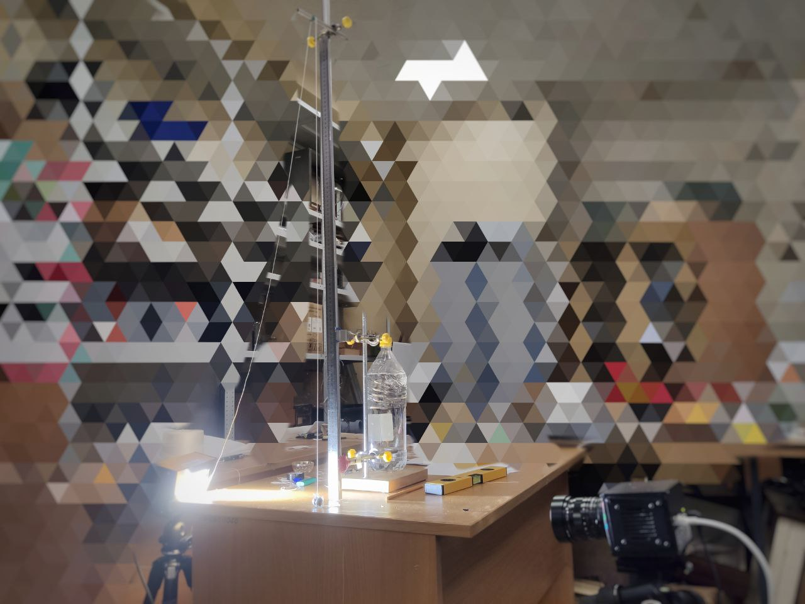

# Question of choice
Project work for the general physics exam at MIPT in the first semester.

## Acknowledgement
I would like to express my special gratitude to [Svetlichny Alexander Olegovich](https://vk.com/alexandr_svetlichnyy) for the instructions and advice that I received in the course of doing this work. I really appreciate the responsiveness of this person and the desire to help me understand the topic.

## About my work
I investigated the process of collision of a rubber ball with a solid horizontal surface in a gravitational field. The result was a model that approximates the deformation of the body during contact (**presentation attached above**)

## Some details of the process
Most of the necessary information can be found in my presentation and in the sources I used. Here I want to talk about the fun points and useful skills that I learned while doing this work. 
- First of all, it's knowledge, it's clear here. My project goes beyond the theory, which is read in the MIPT in the first year - some sections I had to learn additionally. 
- Secondly, it is the skills of working in a group. Yes, during the performance of this work I supervised only one person, but... When there is not much time left before the exam, you have to act quickly and collected, so every move must be correct. I worked with a speed camera, which requires a special spotlight. It had to be turned on after each experiment and then remember to turn it off. You also had to start recording in time and stop it in time, and then process the resulting video. Together with a not very elaborate processing application, once I had to redo all the experiments all over again  
- Third was creativity. I had to come up with a setup that combined simplicity, adjustability, and accuracy (the ball had to fall exactly where the camera was focusing), to find the material with which to conduct the experiment. Here's a picture of my desk one January day:

## Conclusion
For a rubber ball, the impact, while the deformations are linear, is described by the Hooke model, and when nonlinear deformations begin, by the Hertz model

## Literature
- С.П. Тимошенко, Дж. Гудьер "Теория упругости", link: https://pnu.edu.ru/media/filer_public/2013/04/10/5-6_timoshenko1975.pdf;
- Г.К. Боровин, В.В. Лапшин "Обобщённая модель удара Герца-Ханта-Кроссли";
- Д.В. Сивухин "Общий курс физики. Механика".

